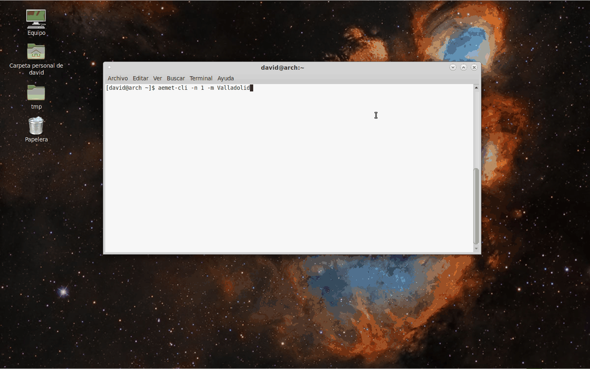

# aemet-cli

aemet-cli es una aplicación de terminal que permite obtener las previsiones del tiempo meteorológico en España. Usa datos abiertos de la Agencia Estatal de Meteorología (AEMET) del Gobierno de España.

## Instalación
### Debian y derivados

1. `sudo apt-get install libxml2-utils jq curl git`
2. `git clone https://github.com/davidpob99/aemet-cli`
3. `cd aemet-cli`
4. `chmod -x INSTALL`
5. `sudo sh INSTALL`

### Arch Linux
[AUR](https://aur.archlinux.org/packages/aemet-cli/)

### Windows

Probablemente se pueda ejecutar en el [subsistema Linux en Windows](https://blogs.msdn.microsoft.com/commandline/learn-about-bash-on-windows-subsystem-for-linux/)

### Android
1. Descargar [Termux](https://play.google.com/store/apps/details?id=com.termux)
2. `apt update && apt upgrade`
3. `pkg install git jq curl libxml2-utils`
4. `git clone https://github.com/davidpob99/aemet-cli`
5. `cd aemet-cli`
6. `chmod -x INSTALL`
7. `sudo sh INSTALL`

## Desinstalación
### Debian y derivados

1. `git clone https://github.com/davidpob99/aemet-cli`
2. `cd aemet-cli`
3. `chmod -x UNINSTALL`
4. `sudo sh UNINSTALL`

### Arch Linux

`sudo pacman -Rs aemet-cli`

## Ejemplos

Ver la previsión de los 7 días siguientes en Salamanca: `aemet-cli -m Salamanca`

Ver la previsión solo del día siguiente en Aranda de Duero: `aemet-cli -n 1 -m 'Aranda de Duero'`

Ver la previsión de los 7 días siguiente sabiendo el id del municipio de Valladolid: `aemet-cli -i 47186`

## Licencia

Código disponible bajo licencia Apache 2.0.
